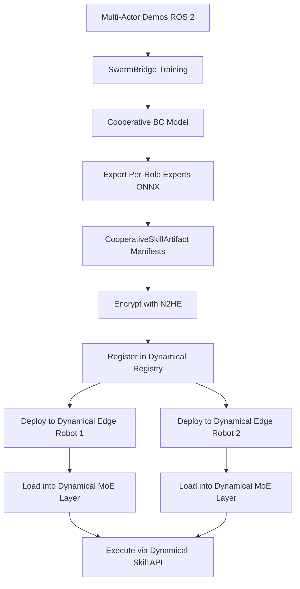

# SwarmBridge Relationship to Dynamical v0.3.3

This document clarifies how SwarmBridge extends Dynamical's skill-centric architecture for multi-actor scenarios.

## Core Principle

**SwarmBridge never replaces Dynamical** - it **feeds it new cooperative skills**. Each robot still runs Dynamical's full edge stack (MOAI + VLA + MoE); SwarmBridge extends the skill catalog with multi-actor coordination behaviors.

## Architecture Layers

```
┌─────────────────────────────────────────────────────────────┐
│  Layer 4: Multi-Actor Swarm IL (SwarmBridge)               │
│  ┌───────────────────────────────────────────────────────┐ │
│  │ • ROS 2 multi-robot demonstration capture            │ │
│  │ • Cooperative BC with coordination encoder           │ │
│  │ • Role-conditioned policy training                   │ │
│  │ • Cross-role consistency regularization              │ │
│  │ • Federated learning across sites                    │ │
│  │ • Export per-role MoE experts                        │ │
│  └───────────────────────────────────────────────────────┘ │
└─────────────────────────────────────────────────────────────┘
                            ▼ Exports Skill Experts
┌─────────────────────────────────────────────────────────────┐
│  Layer 3: Dynamical v0.3.3 Edge Stack (Per Robot)          │
│  ┌───────────────────────────────────────────────────────┐ │
│  │ Tier 1: Perception (MOAI Compression)                │ │
│  │   • 512-dim embeddings from visual/proprioceptive    │ │
│  │                                                       │ │
│  │ Tier 2: Foundation (Pi0/OpenVLA 7B)                  │ │
│  │   • Frozen base model                                │ │
│  │                                                       │ │
│  │ Tier 3: Skills (MoE Layer)                           │ │
│  │   • 10-50M parameter experts per skill               │ │
│  │   • Skill router (natural language → skill)          │ │
│  │   • **Consumes SwarmBridge cooperative experts**     │ │
│  │                                                       │ │
│  │ Tier 4: Privacy (N2HE 128-bit)                       │ │
│  │   • Encrypted gradients/updates                      │ │
│  └───────────────────────────────────────────────────────┘ │
│  Platform: NVIDIA Jetson AGX Orin                           │
└─────────────────────────────────────────────────────────────┘
```

## Data Flow: Inputs from Dynamical

SwarmBridge **consumes** these artifacts from Dynamical:

### 1. MOAI-Compressed Embeddings

```python
# Dynamical perception stack outputs 512-dim embeddings
observation = dynamical_perception.get_moai_embedding(
    rgb_image, depth_image, proprioceptive_state
)
# Shape: (512,)

# SwarmBridge uses these directly as inputs
swarmbridge_input = {
    "observation": observation,  # MOAI 512-dim
    "robot_id": "robot_1",
    "role_id": "giver",
}
```

### 2. Skill IDs from Catalog

SwarmBridge must use the **same skill namespace** as Dynamical:

```python
# Dynamical skill catalog (example)
DYNAMICAL_SKILLS = {
    "handover_box": {
        "input_type": "moai_512",
        "output_dim": 7,  # 7-DOF arm actions
        "skill_type": "manipulation",
    },
    "collaborative_assembly": {
        "input_type": "moai_512",
        "output_dim": 7,
        "skill_type": "multi_actor",  # ← SwarmBridge extends this
    },
}

# SwarmBridge training
train_cooperative_skill(
    skill_id="collaborative_assembly",  # Must match Dynamical catalog
    roles=["assembler_1", "assembler_2"],
    uses_moai=True,
)
```

### 3. Encryption Scheme (N2HE)

SwarmBridge aligns with Dynamical's N2HE encryption:

```python
from swarmbridge.integrations.dynamical import encrypt_for_dynamical_n2he

# Encrypt skill expert for Dynamical deployment
encrypted_checkpoint = encrypt_for_dynamical_n2he(
    checkpoint_path="handover_giver.onnx",
    output_path="handover_giver_encrypted.onnx",
    key_id="dynamical_fleet_key_v3",
)
```

## Data Flow: Outputs to Dynamical

SwarmBridge **produces** these artifacts for Dynamical:

### 1. Per-Role MoE Skill Experts

```python
# SwarmBridge exports role-specific experts
artifacts = build_cooperative_skill_artifacts(
    model=trained_cooperative_model,
    role_configs=[
        {"role_id": "giver", "skill_id": "handover_box"},
        {"role_id": "receiver", "skill_id": "handover_box"},
    ],
    export_format="onnx",  # For Dynamical's ONNX Runtime
)

# Produces:
# - giver.onnx (10-50M parameters)
# - receiver.onnx (10-50M parameters)
# - manifest.json (metadata)
```

These ONNX models plug directly into Dynamical's MoE layer:

```python
# On Dynamical robot (giver)
dynamical_moe_layer.load_skill_expert(
    skill_id="handover_box",
    role_id="giver",
    checkpoint="s3://dynamical-skills/handover_v4/giver.onnx",
)

# On Dynamical robot (receiver)
dynamical_moe_layer.load_skill_expert(
    skill_id="handover_box",
    role_id="receiver",
    checkpoint="s3://dynamical-skills/handover_v4/receiver.onnx",
)
```

### 2. CooperativeSkillArtifact Manifests

```json
{
  "skill_id": "handover_box",
  "role_id": "giver",
  "input_embedding_type": "moai_512",
  "expert_checkpoint_uri": "s3://dynamical-skills/handover_v4/giver.onnx",
  "encryption_scheme": "n2he_128bit",
  "version": "4.0",
  "dynamical_compatibility": {
    "dynamical_version": "0.3.3",
    "moai_version": "0.3.3",
    "moe_layer_compatible": true
  }
}
```

### 3. Registration in Dynamical Skill Registry

```python
register_skills_with_dynamical(
    artifact_manifest=manifest,
    registry_uri="dynamical://skills",
)

# Makes skills available via Dynamical API
# On any robot:
skill = dynamical.get_skill("handover_box", role="giver")
action = skill.execute(observation=moai_embedding)
```

## Key Integration Points

### Integration Point 1: MOAI Embedding Compatibility

**Challenge**: SwarmBridge must use the exact same embedding format as Dynamical.

**Solution**:
```python
# In SwarmBridge training config
TrainingConfig(
    use_moai_embeddings=True,
    moai_version="0.3.3",
    embedding_dim=512,  # Matches Dynamical
)

# Role config
role_config = {
    "observation_dim": 512,  # MOAI embedding size
    "uses_moai": True,
}
```

### Integration Point 2: Skill Catalog Sync

**Challenge**: skill_ids must be consistent across systems.

**Solution**:
- Maintain a **shared skill catalog** (JSON/database)
- SwarmBridge validates `skill_id` exists in Dynamical catalog before training
- Use semantic versioning for skill evolution

### Integration Point 3: MoE Layer Format

**Challenge**: Exported experts must be loadable by Dynamical's MoE layer.

**Solution**:
```python
# SwarmBridge export ensures:
# 1. ONNX opset 14+ (compatible with ONNX Runtime)
# 2. Input names: ["observation", "coordination_latent"]
# 3. Output names: ["action"]
# 4. Dynamic batch dimension

torch.onnx.export(
    role_policy,
    (dummy_obs, dummy_coord),
    "giver.onnx",
    input_names=["observation", "coordination_latent"],
    output_names=["action"],
    dynamic_axes={"observation": {0: "batch_size"}},
    opset_version=14,
)
```

### Integration Point 4: Local-Global Distillation

**Challenge**: Align local swarm policies with global Dynamical priors.

**Solution**:
```python
# SwarmBridge training loop
def train_step_with_distillation(local_demos, global_prior):
    # Behavior cloning on local multi-actor demos
    bc_loss = mse_loss(predicted_actions, demo_actions)
    
    # KL divergence to global Dynamical skill prior
    kl_loss = kl_divergence(
        local_policy_distribution,
        global_prior_distribution  # From Dynamical registry
    )
    
    # Cross-role consistency (SwarmBridge-specific)
    consistency_loss = cross_role_consistency(giver_actions, receiver_actions)
    
    total_loss = bc_loss + 0.1 * kl_loss + 0.05 * consistency_loss
    return total_loss
```

## Federated Learning Alignment

SwarmBridge's FL extends Dynamical's approach to multi-actor:

### Dynamical FL (Single Robot per Site)

```
Site A Robot → Local training on Site A demos
Site B Robot → Local training on Site B demos
Site C Robot → Local training on Site C demos
                ↓
            Flower Server (FedAvg)
                ↓
            Global Skill Prior
```

### SwarmBridge FL (Multi-Robot Swarms per Site)

```
Site A Swarm (Robots 1,2) → Cooperative training on multi-actor demos
Site B Swarm (Robots 3,4) → Cooperative training on multi-actor demos
Site C Swarm (Robots 5,6) → Cooperative training on multi-actor demos
                ↓
            Flower Server (FedAvg + Cross-Role Aggregation)
                ↓
        Global Cooperative Skill Prior (per role)
                ↓
    Deployed back to Dynamical MoE layer on each robot
```

## Deployment Workflow

End-to-end flow from SwarmBridge training to Dynamical execution:



## API Alignment

### Dynamical Skill Execution API

```python
# On Dynamical robot
skill = dynamical.skills.get("pick_object")
action = skill.execute(
    observation=moai_embedding,  # 512-dim
    task_description="pick the red box"
)
```

### SwarmBridge-Extended Skill Execution

```python
# On Dynamical robot (giver role)
cooperative_skill = dynamical.skills.get(
    "handover_box",
    role="giver",  # SwarmBridge addition
)

action = cooperative_skill.execute(
    observation=moai_embedding,  # Same MOAI 512-dim
    task_description="hand the box to receiver",
    coordination_context={
        "partner_roles": ["receiver"],
        "coordination_primitive": "handover",
    }
)
```

The `coordination_context` is provided by SwarmBrain mission orchestration, but executed via Dynamical's skill API.

## Version Compatibility Matrix

| SwarmBridge Version | Dynamical Version | MOAI Version | Status |
|---------------------|-------------------|--------------|--------|
| 2.0.0-dynamical     | 0.3.3            | 0.3.3        | ✅ Tested |
| 2.0.0-dynamical     | 0.3.2            | 0.3.2        | ⚠️ Untested |
| 2.0.0-dynamical     | 0.3.4            | 0.3.4        | 🔄 Future |

## Summary: SwarmBridge as Dynamical Extension

| Aspect | Implementation |
|--------|----------------|
| **Inputs from Dynamical** | MOAI embeddings, skill IDs, N2HE scheme |
| **Outputs to Dynamical** | Per-role MoE experts (ONNX), CSA manifests |
| **Deployment** | Artifacts loaded into Dynamical MoE layer |
| **Execution** | Via Dynamical skill API (with role parameter) |
| **Federated Learning** | Extends Dynamical's FL to multi-actor |
| **Privacy** | Compatible with Dynamical's N2HE encryption |

**Key Takeaway**: SwarmBridge is **not a standalone system** - it's a **skill authoring tool for Dynamical** that specializes in multi-actor cooperative behaviors.
